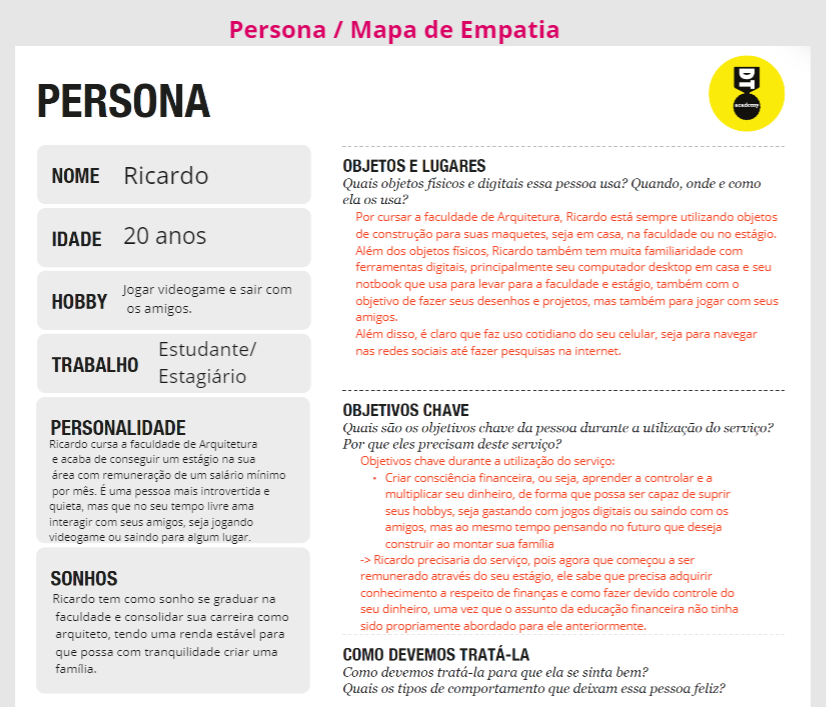
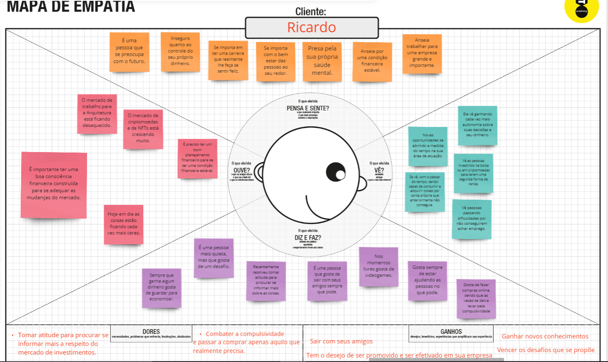
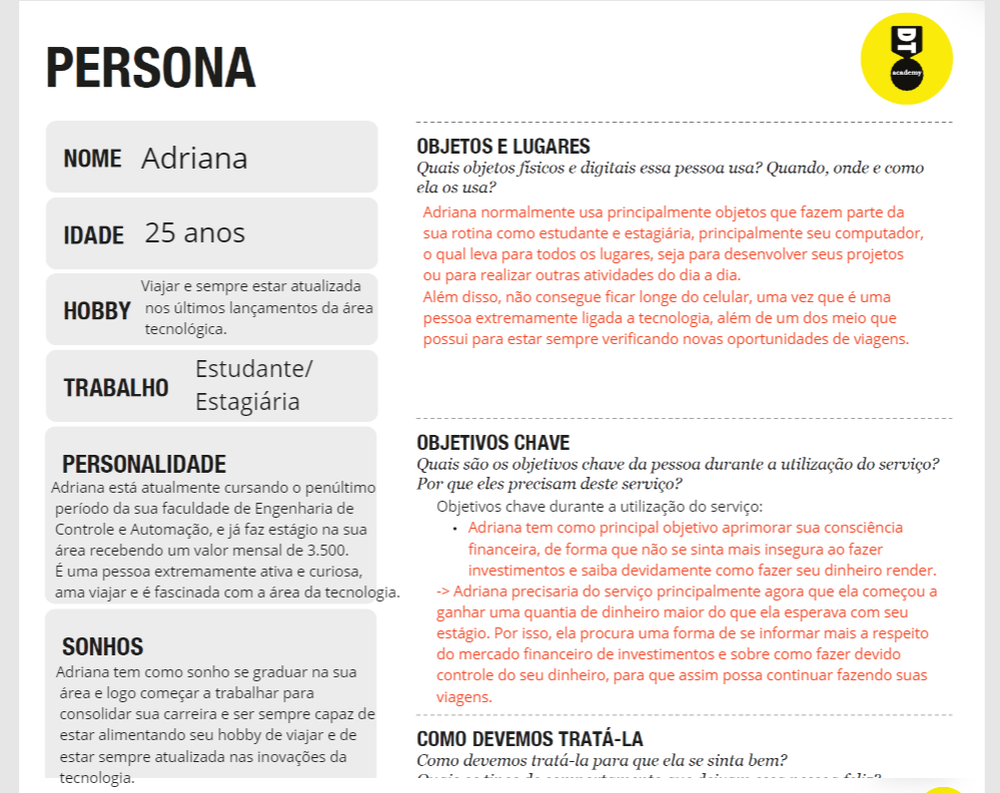
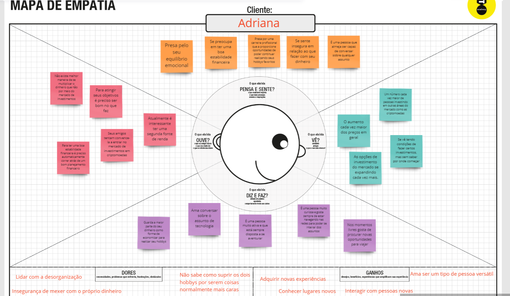

# Informações do Projeto
`TÍTULO DO PROJETO`  

DESINFORMAÇÃO SOBRE EDUCAÇÃO FINANCEIRA

`CURSO` 

CIÊNCIA DA COMPUTAÇÃO

## Participantes

> Os membros do grupo são: 
> - Gabriel Pessotti de Deus
> - Eduardo Michael Guimaraes Gomes
> - Gabriel Arthur Pinto Leite
> - Leonardo Sampaio Zanella
> - Lucas Ferreira Souza
> - Marcio Santos Rezende Silva Oliveira
> - Vanessa Paiva Costa

# Estrutura do Documento

- [Informações do Projeto](#informações-do-projeto)
  - [Participantes](#participantes)
- [Estrutura do Documento](#estrutura-do-documento)
- [Introdução](#introdução)
  - [Problema](#problema)
  - [Objetivos](#objetivos)
  - [Justificativa](#justificativa)
  - [Público-Alvo](#público-alvo)
- [Especificações do Projeto](#especificações-do-projeto)
  - [Personas e Mapas de Empatia](#personas-e-mapas-de-empatia)
  - [Histórias de Usuários](#histórias-de-usuários)
  - [Requisitos](#requisitos)
    - [Requisitos Funcionais](#requisitos-funcionais)
    - [Requisitos não Funcionais](#requisitos-não-funcionais)
  - [Restrições](#restrições)
- [Projeto de Interface](#projeto-de-interface)
  - [User Flow](#user-flow)
  - [Wireframes](#wireframes)
- [Metodologia](#metodologia)
  - [Divisão de Papéis](#divisão-de-papéis)
  - [Ferramentas](#ferramentas)
  - [Controle de Versão](#controle-de-versão)
- [**############## SPRINT 1 ACABA AQUI #############**](#-sprint-1-acaba-aqui-)
- [Projeto da Solução](#projeto-da-solução)
  - [Tecnologias Utilizadas](#tecnologias-utilizadas)
  - [Arquitetura da solução](#arquitetura-da-solução)
- [Avaliação da Aplicação](#avaliação-da-aplicação)
  - [Plano de Testes](#plano-de-testes)
  - [Ferramentas de Testes (Opcional)](#ferramentas-de-testes-opcional)
  - [Registros de Testes](#registros-de-testes)
- [Referências](#referências)

# Introdução

## Problema

> O problema cujo nossa aplicação busca resolver, gira em torno da desinformação
> sobre a educação financeira, que no caso configura-se como um tema de pouca
> acessibilidade, uma vez que é pouco ou indevidamente abordado nas escolas e até mesmo dentro
> de casa.
> 
> A partir disso, é inegável a existência de um déficit no ensino da educação financeira, o que
> resulta na formação de jovens despreparados e incapazes de fazerem devido controle de seu dinheiro.

## Objetivos

> Nosso objetivo em geral é de desenvolver um software que seja capaz de tonar as informações
> sobre educação financeira mais acessíveis, de forma que, mesmo tendo como alvo o público mais jovem,
> ainda seja capaz de fazer com que qualquer pessoa, a qualquer momento, e de qualquer lugar seja
> capaz de acessar o site e sanar suas dúvidas a respeito do mercado financeiro.
> Tendo isso em vista, nosso sistema procura ser capaz, principalmente, de ajudar as pessoas a criarem consciência
> financeira de forma mais fácil e gratuita.
> 

## Justificativa

> O motivo para a escolha dessa aplicação é que, com a evolução da tecnologia e dos meios de comunicação, era 
> inevitável que as pessoas fossem, com o passar das gerações, introduzidas mais rápidas nesse meio tecnológico,
> o que automaticamente as faria ter contato com novas oportunidades de mexer com dinheiro de forma online, seja
> por meio de compras na internet ou até mesmo por meio do mercado financeiro de criptomoedas, NFTs, etc.
> Por isso, consideramos de suma importância que essas pessoas tenham contato o mais cedo possível com a educação
> financeira, uma vez que é preciso ter o mínimo de consciência financeira frentre a um cenário tão instável, mas que
> da forma correta pode ser aproveitado para benefício próprio.

## Público-Alvo

> Qualquer pessoa pode fazer proveito do que nosso site tem a oferecer, mas no momento temos estabelecido como público alvo
> homens e mulheres de 18 a 26 anos, estudantes universitários/estagiários, com renda mensal
> entre 1.000 e 5.000 reais. Procuram aprender mais sobre educação financeira e como fazer
> melhor controle do seu dinheiro. Os usuários tem maior familiaridade com a tecnologia e 
> começaram a ter uma maior fonte de renda, e por isso estão dispostos a procurar uma forma 
> online de se inteirar a respeito do assunto e criar certa consciência financeira.
 
# Especificações do Projeto

> A seguir, apresentaremos as personas e seus respectivos mapas de empatia, ou seja, personagens que representam um tipo de cliente ideal para
> fazer acesso ao site. Para tal, foi utilizado o ambiente Miro para criação dos templates.

> Apresente uma visão geral do que será abordado nesta parte do
> documento, enumerando as técnicas e/ou ferramentas utilizadas para
> realizar a especificações do projeto

## Personas e Mapas de Empatia
 
> **Persona 1**
> 
> 
> 

> **Persona 2**
> 
> 
> 
>

## Histórias de Usuários

Com base na análise das personas foram identificadas as seguintes histórias de usuários:

|EU COMO... `Persona`| QUERO/PRECISO ... `FUNCIONALIDADE` |PARA ... `MOTIVO/VALOR`                 |
|--------------------|------------------------------------|----------------------------------------|
|Ricardo             | Entender os pilares da educação financeira                         | Ganhar mais independência                     |
|Ricardo             | Aprender saber quais são as formas de investimento                 | Ter mais controle sobre meu dinheiro          |
|Ricardo             | Aprender como guardar devidamente o dinheiro para faze-lo render   | Trabalhar em sua estabilidade financeira      |
|Adriana             | Aprimorar minha consciência financeira                             | Me sentir menos insegura                      |
|Adriana             | Aprender a investir                                                | Multiplicar meu dinheiro                      |
|Adriana             | Aprender quais são os principais tipos de impostos cobrados        | Começar a se planejar financeiramente         |

## Requisitos

As tabelas que se seguem apresentam os requisitos funcionais e não funcionais que detalham o escopo do projeto.

### Requisitos Funcionais

|ID    | Descrição do Requisito  | Prioridade |
|------|-----------------------------------------|----|
|RF-01| O sistema deve permitir o cadastro de novos usuários           | ALTA | 
|RF-02| Divisão do site em categorias           | ALTA | 
|RF-03| Permitir que o usuário acesse mais conteúdos de acordo com a categoria que selecionou   | ALTA |
|RF-04| Permitir que o usuário acesse uma parte do site voltada para vídeos que aprofundem sobre o assunto de determinada categoria   | ALTA |
|RF-05| O site deve conter um botão de menu que o permita selecionar a categoria que deseja acessar   | ALTA |
|RF-06| Os conteúdos do site devem ser acompanhados de imagens e vídeos   | ALTA |
|RF-07| O site deve ter uma área em que os usuários possam fazer compartilhamento de conteúdos   | MÉDIA |

### Requisitos não Funcionais

|ID     | Descrição do Requisito  |Prioridade |
|-------|-------------------------|----|
|RNF-001| O sistema deve ser responsivo para rodar em um dispositivos móvel | MÉDIA | 
|RNF-002| O site deve conter uma linguagem simples e objetiva |  ALTA | 
|RNF-003| O site deve ser de fácil navegação |  ALTA | 
|RNF-004| A visualização da tela deve ser simples, evitando ao máximo o excesso de informações |  MÉDIA | 
|RNF-005| O site deve ser compatível com outras plataformas de navegação |  MÉDIA | 
> 

## Restrições

O projeto está restrito pelos itens apresentados na tabela a seguir.

|ID| Restrição                                             |
|--|-------------------------------------------------------|
|01| O projeto deverá ser entregue até o final do semestre |
|02| Não pode ser desenvolvido um módulo de backend        |
|03| O projeto deve ser desenvolvido apenas entre os integrantes do grupo        |

# Projeto de Interface

A interface do nosso site foi desenvolvido com o propósito de proporcionar uma navegação simples
para o usuário, de forma que as pessoas possam facilmente vizualizar todo o conteúdo que o site tem a 
oferecer. Assim, o site possui atalhos como o botão de menu que buscam facilitar a navegação do usuário.

## User Flow

> 

## Wireframes

> 
> 
> 
> 

# Metodologia

......  COLOQUE AQUI O SEU TEXTO ......

> Nesta parte do documento, você deve apresentar a metodologia 
> adotada pelo grupo, descrevendo o processo de trabalho baseado nas metodologias ágeis, 
> a divisão de papéis e tarefas, as ferramentas empregadas e como foi realizada a
> gestão de configuração do projeto via GitHub.
>
> Coloque detalhes sobre o processo de Design Thinking e a implementação do Framework Scrum seguido
> pelo grupo. O grupo poderá fazer uso de ferramentas on-line para acompanhar
> o andamento do projeto, a execução das tarefas e o status de desenvolvimento
> da solução.
> 
> **Links Úteis**:
> - [Tutorial Trello](https://trello.com/b/8AygzjUA/tutorial-trello)
> - [Gestão ágil de projetos com o Trello](https://www.youtube.com/watch?v=1o9BOMAKBRE)
> - [Gerência de projetos - Trello com Scrum](https://www.youtube.com/watch?v=DHLA8X_ujwo)
> - [Tutorial Slack](https://slack.com/intl/en-br/)

## Divisão de Papéis

> - Product owner: Lucas Ferreira Souza 
> - Scrum master: Gabriel Pessotti de Deus
> - Desenvolvedores: Vanessa Paiva Costa, Gabriel Arthur Pinto Leite, Leonardo Sampaio Zanella, Eduardo Michael Guimaraes Gomes, Marcio Santos Rezende Silva Oliveira. 

## Ferramentas

......  COLOQUE AQUI O SEU TEXTO - SIGA O EXEMPLO DA TABELA ABAIXO  ......

| Ambiente  | Plataforma              |Link de Acesso |
|-----------|-------------------------|---------------|
|Processo de Design Thinkgin  | Miro |  https://miro.com/XXXXXXX | 
|Repositório de código | GitHub | https://github.com/XXXXXXX | 
|Hospedagem do site | Heroku |  https://XXXXXXX.herokuapp.com | 
|Protótipo Interativo | MavelApp ou Figma | https://figma.com/XXXXXXX | 

>
> Liste as ferramentas empregadas no desenvolvimento do
> projeto, justificando a escolha delas, sempre que possível.
> 
> As ferramentas empregadas no projeto são:
> 
> - Editor de código.
> - Ferramentas de comunicação
> - Ferramentas de diagramação
> - Plataforma de hospedagem
> 
> O editor de código foi escolhido porque ele possui uma integração com o
> sistema de versão. As ferramentas de comunicação utilizadas possuem
> integração semelhante e por isso foram selecionadas. Por fim, para criar
> diagramas utilizamos essa ferramenta por melhor captar as
> necessidades da nossa solução.
> 
> **Links Úteis - Hospedagem**:
> - [Getting Started with Heroku](https://devcenter.heroku.com/start)
> - [Crie seu Site com o HostGator](https://www.hostgator.com.br/como-publicar-seu-site)
> - [GoDady](https://br.godaddy.com/how-to)
> - [GitHub Pages](https://pages.github.com/)

## Controle de Versão

......  COLOQUE AQUI O SEU TEXTO ......

> Discuta como a configuração do projeto foi feita na ferramenta de
> versionamento escolhida. Exponha como a gerência de tags, merges,
> commits e branchs é realizada. Discuta como a gerência de issues foi
> realizada.
> A ferramenta de controle de versão adotada no projeto foi o
> [Git](https://git-scm.com/), sendo que o [Github](https://github.com)
> foi utilizado para hospedagem do repositório `upstream`.
> 
> O projeto segue a seguinte convenção para o nome de branchs:
> 
> - `master`: versão estável já testada do software
> - `unstable`: versão já testada do software, porém instável
> - `testing`: versão em testes do software
> - `dev`: versão de desenvolvimento do software
> 
> Quanto à gerência de issues, o projeto adota a seguinte convenção para
> etiquetas:
> 
> - `bugfix`: uma funcionalidade encontra-se com problemas
> - `enhancement`: uma funcionalidade precisa ser melhorada
> - `feature`: uma nova funcionalidade precisa ser introduzida
>
> **Links Úteis**:
> - [Tutorial GitHub](https://guides.github.com/activities/hello-world/)
> - [Git e Github](https://www.youtube.com/playlist?list=PLHz_AreHm4dm7ZULPAmadvNhH6vk9oNZA)
> - [5 Git Workflows & Branching Strategy to deliver better code](https://zepel.io/blog/5-git-workflows-to-improve-development/)
>
> **Exemplo - GitHub Feature Branch Workflow**:
>
> 

# **############## SPRINT 1 ACABA AQUI #############**

# Projeto da Solução

......  COLOQUE AQUI O SEU TEXTO ......

## Tecnologias Utilizadas

......  COLOQUE AQUI O SEU TEXTO ......

> Descreva aqui qual(is) tecnologias você vai usar para resolver o seu
> problema, ou seja, implementar a sua solução. Liste todas as
> tecnologias envolvidas, linguagens a serem utilizadas, serviços web,
> frameworks, bibliotecas, IDEs de desenvolvimento, e ferramentas.
> Apresente também uma figura explicando como as tecnologias estão
> relacionadas ou como uma interação do usuário com o sistema vai ser
> conduzida, por onde ela passa até retornar uma resposta ao usuário.
> 
> Inclua os diagramas de User Flow, esboços criados pelo grupo
> (stoyboards), além dos protótipos de telas (wireframes). Descreva cada
> item textualmente comentando e complementando o que está apresentado
> nas imagens.

## Arquitetura da solução

......  COLOQUE AQUI O SEU TEXTO E O DIAGRAMA DE ARQUITETURA .......

> Inclua um diagrama da solução e descreva os módulos e as tecnologias
> que fazem parte da solução. Discorra sobre o diagrama.
> 
> **Exemplo do diagrama de Arquitetura**:
> 
> 

# Avaliação da Aplicação

......  COLOQUE AQUI O SEU TEXTO ......

> Apresente os cenários de testes utilizados na realização dos testes da
> sua aplicação. Escolha cenários de testes que demonstrem os requisitos
> sendo satisfeitos.

## Plano de Testes

......  COLOQUE AQUI O SEU TEXTO ......

> Enumere quais cenários de testes foram selecionados para teste. Neste
> tópico o grupo deve detalhar quais funcionalidades avaliadas, o grupo
> de usuários que foi escolhido para participar do teste e as
> ferramentas utilizadas.
> 
> **Links Úteis**:
> - [IBM - Criação e Geração de Planos de Teste](https://www.ibm.com/developerworks/br/local/rational/criacao_geracao_planos_testes_software/index.html)
> - [Práticas e Técnicas de Testes Ágeis](http://assiste.serpro.gov.br/serproagil/Apresenta/slides.pdf)
> -  [Teste de Software: Conceitos e tipos de testes](https://blog.onedaytesting.com.br/teste-de-software/)

## Ferramentas de Testes (Opcional)

......  COLOQUE AQUI O SEU TEXTO ......

> Comente sobre as ferramentas de testes utilizadas.
> 
> **Links Úteis**:
> - [Ferramentas de Test para Java Script](https://geekflare.com/javascript-unit-testing/)
> - [UX Tools](https://uxdesign.cc/ux-user-research-and-user-testing-tools-2d339d379dc7)

## Registros de Testes

......  COLOQUE AQUI O SEU TEXTO ......

> Discorra sobre os resultados do teste. Ressaltando pontos fortes e
> fracos identificados na solução. Comente como o grupo pretende atacar
> esses pontos nas próximas iterações. Apresente as falhas detectadas e
> as melhorias geradas a partir dos resultados obtidos nos testes.

# Referências

......  COLOQUE AQUI O SEU TEXTO ......

> Inclua todas as referências (livros, artigos, sites, etc) utilizados
> no desenvolvimento do trabalho.
> 
> **Links Úteis**:
> - [Formato ABNT](https://www.normastecnicas.com/abnt/trabalhos-academicos/referencias/)
> - [Referências Bibliográficas da ABNT](https://comunidade.rockcontent.com/referencia-bibliografica-abnt/)
